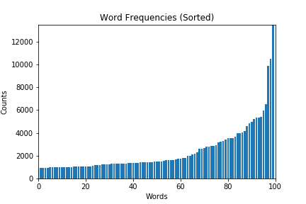
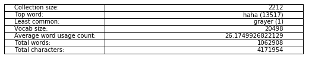
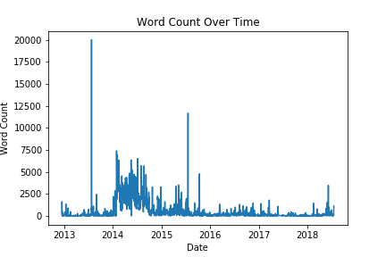
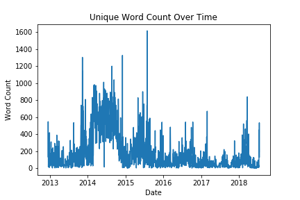

# Map-My-Writing
Doing NLP analysis on text file collections (to visualize, to map, to understand)

## Outline
- Word Frequency Analysis
- Basic Vocab Statistics 
- Word Count Over Time

## Word Frequency Analysis

## Basic Vocab Statistics 

## Word Count Over Time

